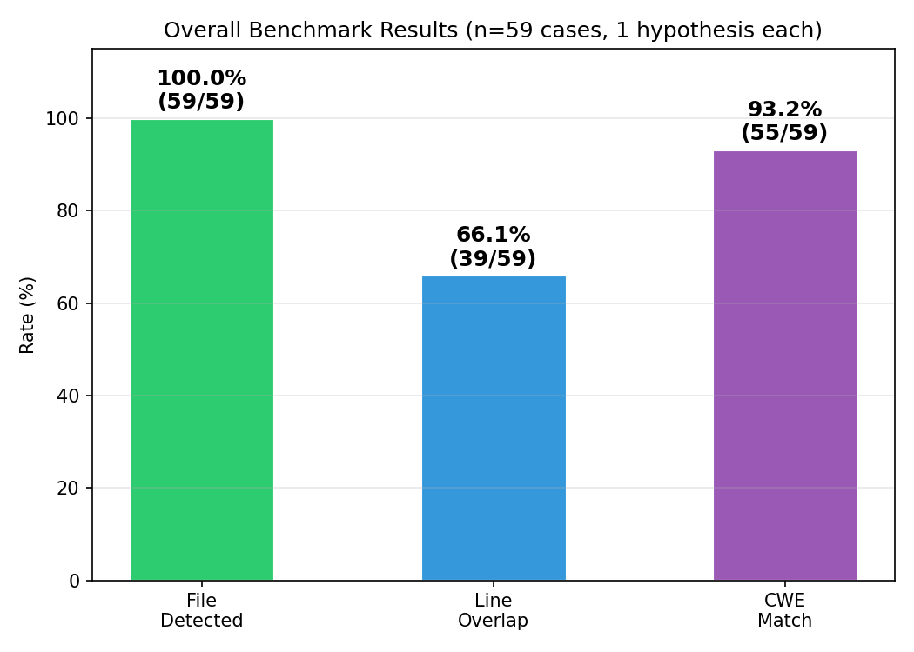
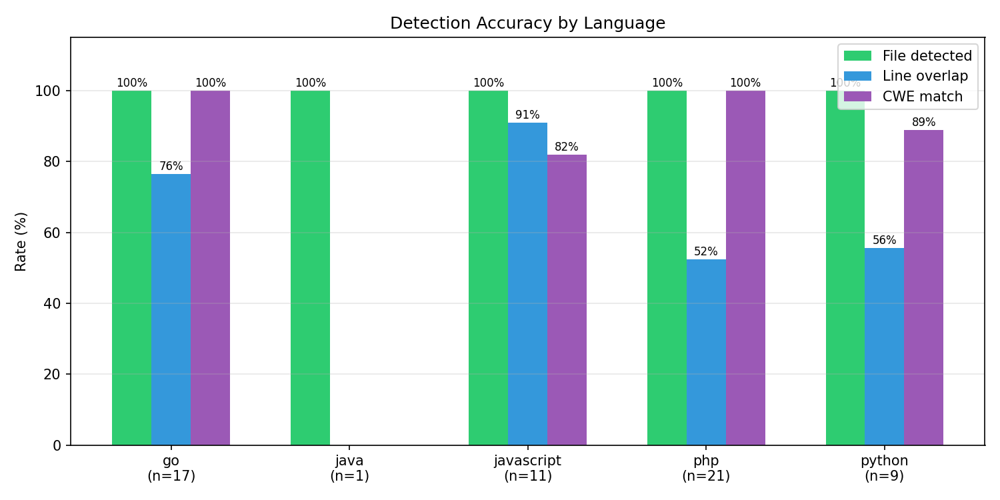
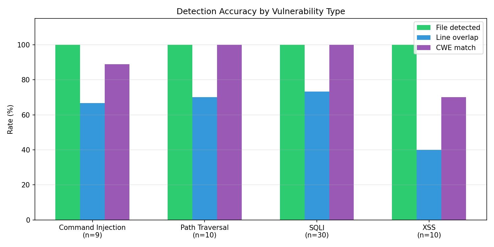
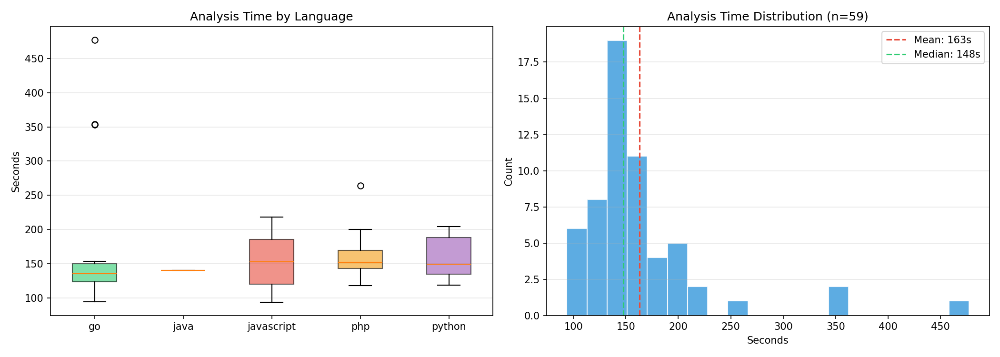

# AgentSAST

An agentic SAST (Static Application Security Testing) tool that uses a hypothesis-driven planner/analyzer architecture. Model-agnostic. Works with AWS Bedrock (Claude), OpenAI (GPT-4o), or local models (Ollama, llama.cpp, vLLM).

### Why it works

The core insight is combining **semantic code search** with **CodeQL's interprocedural taint tracking**. These two tools complement each other in a way neither could work alone:

- **Semantic search** finds the sinks. The agent describes what it's looking for in natural language (*"function that builds a database query from request parameters"*) and gets back the relevant code chunks without reading every file. That's discovery.

- **CodeQL** proves the data flow. The agent writes a targeted taint-tracking query for the specific source-sink pair it suspects, and CodeQL traces it across the entire call graph through function calls, callbacks, middleware chains. That's verification.

Together, the agent spends tokens on *reasoning about what to investigate* rather than on reading code or tracing flows manually.

## Installation

```bash
git clone https://github.com/anon767/AgentSAST.git
cd AgentSAST

python3 -m venv .venv
.venv/bin/pip install -e .

# Install CodeQL (optional but recommended)
# Download the bundle from https://github.com/github/codeql-action/releases
# Extract and symlink the binary to your PATH
```

### Requirements

- Python 3.9+
- One of:
  - AWS credentials with Bedrock access (Claude + Titan Embeddings)
  - OpenAI API key (`OPENAI_API_KEY` env or `--api-key`)
  - Local model server (Ollama, vLLM, llama.cpp) running on localhost
- CodeQL CLI (install from [GitHub releases](https://github.com/github/codeql-action/releases))

## Usage

```bash
# Bedrock (default)
sast-agent scan /path/to/repo -o report.json

# OpenAI
sast-agent scan /path/to/repo -p openai -o report.json

# Local model via Ollama
sast-agent scan /path/to/repo -p local --model qwen2.5-coder:32b -o report.json

# Scan changed files in a PR
sast-agent scan /path/to/repo --diff-base main -o report.json

# Hybrid SAST + DAST: agents can probe the live app
sast-agent scan /path/to/repo --target-url http://localhost:3000 -o report.json

# Verbose logging (see every tool call)
sast-agent scan /path/to/repo -v -o report.json
```

### CLI options

```
Usage: sast-agent scan [OPTIONS] [REPO_PATH]

Options:
  -p, --provider [bedrock|openai|local]  LLM provider (default: bedrock)
  --model TEXT                Model ID (auto-detected per provider if empty)
  --api-key TEXT              API key (OpenAI, or use OPENAI_API_KEY env)
  --base-url TEXT             API base URL (local models, or OpenAI override)
  --region TEXT               AWS region (Bedrock only, default: us-east-1)
  --embedding-provider TEXT   Embedding provider (defaults to --provider)
  --embedding-model TEXT      Embedding model ID
  -d, --diff-base TEXT        Git ref to diff against (e.g. main)
  -f, --files TEXT            Specific files to scan (repeatable)
  -n, --max-hypotheses INT    Max hypotheses to generate (default: 15)
  -t, --target-url TEXT       Live app URL for DAST probing
  -o, --output TEXT           Write JSON report to file
  --log-file TEXT             Write debug log to file
  --no-codeql                 Disable CodeQL
  --no-semantic               Disable semantic search
  --no-poc                    Disable PoC generation
  -v, --verbose               Enable verbose logging
```

## How it works

```
┌─────────────────────────────────────────────────────────┐
│                      Orchestrator                       │
│                                                         │
│  ┌───────────┐    ┌────────────┐    ┌──────────────┐   │
│  │  Planner   │───▶│  Analyzer  │───▶│   Verifier   │   │
│  │  (broad)   │    │  (deep)    │    │  (deduplicate│   │
│  │            │    │  × N       │    │   + rank)    │   │
│  └───────────┘    └────────────┘    └──────────────┘   │
│        │                │                               │
│        ▼                ▼                               │
│  ┌──────────────────────────────────────────────────┐   │
│  │                  Shared Tools                     │   │
│  │  shell · grep · git · CodeQL · semantic search   │   │
│  │  file reader · Python REPL (sandboxed / DAST)    │   │
│  └──────────────────────────────────────────────────┘   │
└─────────────────────────────────────────────────────────┘
```

### Phase 1: Planner

The planner agent stays **broad and shallow**. It explores the repository structure, reads route definitions, checks auth boundaries, and uses semantic search to map the attack surface. It produces a ranked queue of structured hypotheses:

```json
{
  "hypothesis": "User-controlled query parameter reaches MongoDB $where clause",
  "risk_area": "sqli",
  "priority": "critical",
  "entrypoints": ["GET /allocations/:userId"],
  "files": ["app/data/allocations-dao.js"],
  "suggested_queries": ["CodeQL taint query for request param to database sink"]
}
```

The planner does not dive deep into any single code path. That's the analyzer's job.

### Phase 2: Analyzers

Each hypothesis gets its own analyzer agent: A **separate agent instance** with a fresh conversation, dedicated system prompt, and independent tool-use loop. The analyzer's job is binary: **prove it, disprove it, or mark it uncertain** with evidence.

An analyzer will:
- Read the specific files identified by the planner
- Trace data flow from entry point to sink
- Run CodeQL queries (built-in or custom QL written on the fly)
- Use semantic search to find related sanitizers, validators, or similar patterns
- Check for counter-evidence (input validation, parameterized queries, auth middleware)
- Write a minimal PoC if the vulnerability is confirmed
- In DAST mode, send HTTP requests to the live application to verify exploitability
- Return a structured verdict with confidence score

```json
{
  "status": "confirmed",
  "confidence": 0.95,
  "evidence": [...],
  "counter_evidence_checked": ["Checked for input validation — none found"],
  "exploitability": "Any authenticated user can inject via threshold parameter",
  "minimal_fix": "Replace $where with proper query operators",
  "test_or_poc": "GET /allocations/1?threshold=0'; return true; //"
}
```

Analyzers share a semantic index and CodeQL database so those costs are paid once.

### Phase 3: Verifier

The verifier takes all analyzer outputs and:
- **Deduplicates** overlapping findings (same file + same vuln type)
- **Challenges** weak evidence: downgrades low-confidence confirmations
- **Ranks** by severity and confidence
- Produces the final report with an executive summary

## LLM Providers

| Provider | LLM | Embeddings | Notes |
|----------|-----|------------|-------|
| `bedrock` | Claude Sonnet 4 | Titan Embeddings V2 | Default. Uses AWS credentials. |
| `openai` | GPT-4o | text-embedding-3-small | Uses `OPENAI_API_KEY` env or `--api-key`. |
| `local` | Any model via Ollama/vLLM/llama.cpp | nomic-embed-text or similar | Connects to OpenAI-compatible API at localhost. |

You can mix providers, for example, use OpenAI for the LLM and a local model for embeddings:

```bash
sast-agent scan /path/to/repo -p openai --embedding-provider local --embedding-model nomic-embed-text
```

## Tools

| Tool | Description |
|------|-------------|
| `shell` | Safe shell execution (allowlisted commands: ls, find, cat, grep, git, codeql, etc.) |
| `read_file` | Read any file in the repository |
| `list_files` | Tree view of the repo structure |
| `grep_code` | Regex search across the codebase |
| `git_diff` | Unified diff against a base ref |
| `git_changed_files` | List changed files in a PR/branch |
| `git_log` | Recent commit history |
| `codeql_run` | Run built-in CodeQL queries by risk area (sqli, xss, ssrf, etc.) |
| `codeql_query_raw` | Write and execute **arbitrary CodeQL QL** inline. custom taint tracking, data flow, anything |
| `codeql_list_queries` | List available built-in queries for a language |
| `semantic_search` | FAISS-backed vector search over AST-chunked code (tree-sitter + embeddings) |
| `semantic_index_files` | Add specific files to the search index |
| `semantic_index_status` | Check index stats |
| `python_exec` | Sandboxed Python REPL for PoC generation. In DAST mode, `requests` is unlocked but scoped to the target host only. |

### Semantic search

1. **Parses** every source file with [tree-sitter](https://tree-sitter.github.io/) (JS, TS, Java, Go, Ruby, Rust, C, C++, C#) or Python's `ast` module, extracting functions, classes, methods, and top-level blocks as individual chunks with metadata.

2. **Embeds** each chunk using the configured embedding provider (Bedrock Titan, OpenAI, or local).

3. **Indexes** the vectors in a [FAISS](https://github.com/facebookresearch/faiss) flat inner-product index for fast cosine similarity search.

4. **Searches** by natural-language description of the code pattern you're looking for.

### CodeQL

Both built-in and arbitrary queries are supported. The `codeql_query_raw` tool lets agents write full QL source inline:

```
import javascript

from CallExpr call
where call.getCalleeName() = "eval"
select call, "eval() call found"
```

A temporary qlpack with the correct language dependencies is auto-generated, `codeql pack install` resolves them, and the query runs against the database. Results come back as SARIF or CSV.

## Output

```json
{
  "scan_id": "55a2bd46faa94d27",
  "timestamp": "2026-05-02T18:43:48Z",
  "repo": "/path/to/repo",
  "findings": [
    {
      "title": "Server-Side JavaScript Injection via eval()",
      "severity": "critical",
      "confidence": 0.95,
      "description": "...",
      "affected_files": ["app/routes/contributions.js"],
      "evidence": [{ "description": "...", "file": "...", "snippet": "..." }],
      "exploitability": "...",
      "minimal_fix": "...",
      "test_or_poc": "..."
    }
  ],
  "hypotheses_total": 8,
  "hypotheses_confirmed": 7,
  "hypotheses_disproven": 0,
  "hypotheses_uncertain": 1,
  "summary": "Executive summary of all findings..."
}
```

## Example: scanning OWASP NodeGoat

```bash
git clone https://github.com/OWASP/NodeGoat.git /tmp/nodegoat
sast-agent scan /tmp/nodegoat --max-hypotheses 8 -o report.json
```

Results from a real scan (8 hypotheses, ~10 minutes):

| Severity | Finding | Confidence |
|----------|---------|------------|
| CRITICAL | eval() RCE in contributions handler | 95% |
| CRITICAL | NoSQL injection via $where in allocations | 95% |
| HIGH | SSRF in research endpoint | 95% |
| HIGH | Stored XSS (autoescape disabled) | 95% |
| HIGH | Open redirect in /learn | 95% |
| HIGH | Plaintext password storage | 95% |
| MEDIUM | IDOR in allocations | 95% |

7 confirmed, 0 false positives.

## Benchmarking

Evaluated against [AICGSecEval](https://github.com/Tencent/AICGSecEval) (Tencent), a repository-level benchmark of real-world CVEs across PHP, Python, Go, JavaScript, and Java. Each test case is a real GitHub repo checked out at the vulnerable commit, with ground-truth file paths and line ranges.

**Configuration**: 1 hypothesis per case, Claude Sonnet 4 on Bedrock, all tools enabled.

### Results (59 evaluated cases)



| Metric | Score |
|--------|-------|
| **Vulnerability found** (flagged correct file as vulnerable) | **59/59 (100%)** |
| **Line overlap** (evidence hits exact vulnerable lines) | **39/59 (66.1%)** |
| **CWE match** (correct vulnerability category) | **55/59 (93.2%)** |

### By language



| Language | Detected | Line Overlap |
|----------|----------|--------------|
| Go (17) | 100% | 76% |
| JavaScript (11) | 100% | 91% |
| PHP (21) | 100% | 52% |
| Python (9) | 100% | 56% |
| Java (1) | 100% | 0% |

### By vulnerability type



| Vuln Type | Detected | Line Overlap |
|-----------|----------|--------------|
| SQL Injection (30) | 100% | 73% |
| Path Traversal (10) | 100% | 70% |
| Command Injection (9) | 100% | 67% |
| XSS (10) | 100% | 40% |

### Timing



### Running the benchmark

```bash
git clone https://github.com/Tencent/AICGSecEval.git /tmp/AICGSecEval

python benchmark/run_benchmark.py \
    --dataset /tmp/AICGSecEval/data/data_v1.json \
    --max-hypotheses 1 \
    -o benchmark-results.json

python benchmark/plot_results.py benchmark-results.json
```

## Architecture

```
sast_agent/
├── cli.py                  # Click CLI entry point
├── config.py               # Pydantic config models (LLMConfig, EmbeddingConfig, etc.)
├── models.py               # Hypothesis, Evidence, Finding, ScanReport
├── orchestrator.py         # Planner → Analyzer(s) → Verifier pipeline
├── tool_registry.py        # Tool definitions + dispatch handler
├── utils.py                # Shared JSON extraction utilities
├── providers/
│   ├── __init__.py         # Factory functions (create_llm_from_config, etc.)
│   ├── base.py             # Abstract LLMProvider + EmbeddingProvider
│   ├── bedrock.py          # AWS Bedrock (Claude + Titan Embeddings)
│   ├── openai_provider.py  # OpenAI (GPT-4o + text-embedding-3)
│   └── local.py            # Local models via OpenAI-compatible API
├── agents/
│   ├── planner.py          # Broad attack surface mapping
│   ├── analyzer.py         # Deep hypothesis investigation
│   └── verifier.py         # Deduplication + ranking
└── tools/
    ├── shell.py            # Allowlisted shell execution
    ├── git_tools.py        # Git diff, log, grep
    ├── codeql.py           # CodeQL database, queries, raw QL execution
    ├── semantic_search.py  # Tree-sitter chunking + embeddings + FAISS
    └── python_repl.py      # Sandboxed Python for PoCs (DAST-aware)
```

## Design principles

- **Hypothesis-driven**: the planner creates bounded hypotheses; analyzers don't wander
- **Evidence-based**: every finding requires concrete evidence and counter-evidence checks
- **Disciplined agents**: each analyzer has one job to prove or disprove a specific hypothesis
- **Model-agnostic**: swap between Bedrock, OpenAI, or local models with a CLI flag
- **Safe by default**: shell allowlist, Python sandbox, DAST requests scoped to target host only
- **Shared context**: all analyzers reuse the same FAISS index and CodeQL database
